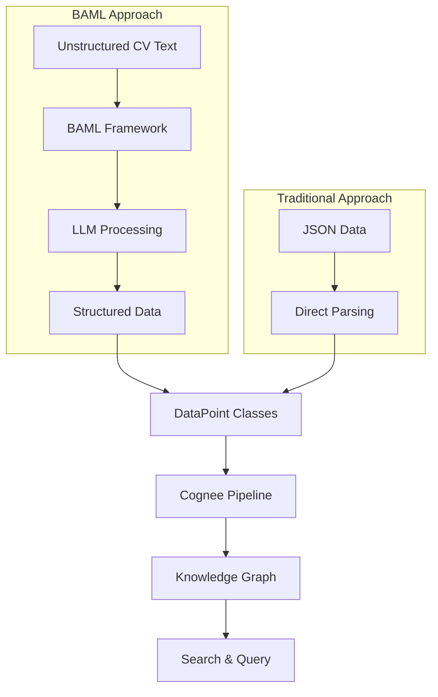

# BAML-Generated Classes for CV Processing with Cognee

## Summary

This directory contains a complete example of how to use BAML (Behavioral Abstraction Markup Language) framework to process CV/Resume data with Cognee's low-level API, replacing the traditional JSON-based approach with intelligent LLM-powered extraction.

## 🎯 Key Benefits of BAML Approach

### vs Traditional JSON Approach
| Feature | JSON Approach | BAML Approach |
|---------|---------------|---------------|
| **Input Format** | Pre-structured JSON | Unstructured CV text |
| **Data Preparation** | Manual structuring | Automatic extraction |
| **Schema Flexibility** | Fixed schema | Adaptive, intelligent schema |
| **Information Richness** | Limited to predefined fields | Rich, contextual extraction |
| **Scalability** | Manual effort per new format | Automatic handling of any format |
| **Intelligence** | Rule-based parsing | LLM-powered understanding |

### Real-World Advantages
- ✅ **Process any CV format** (PDF text, Word docs, plain text)
- ✅ **Extract nuanced information** (skill levels, experience context, achievements)
- ✅ **Handle variations** (different CV styles, languages, formats)
- ✅ **Rich relationships** (person-skill-company-project connections)
- ✅ **Intelligent categorization** (automatic skill grouping, industry inference)

## 📁 File Structure

```
examples/low_level/
├── cv_models.baml                    # BAML model definitions for CV structures
├── cv_models.py                      # Python DataPoint classes
├── cv_data.json                      # Sample structured data (for comparison)
├── cv_pipeline_baml.py               # Basic BAML integration example
├── cv_pipeline_baml_advanced.py     # Advanced BAML features demonstration
├── comparison_json_vs_baml.py        # Direct comparison of approaches
├── README_CV_BAML.md                 # Comprehensive documentation
├── MIGRATION_GUIDE.md                # Step-by-step migration guide
└── BAML_CV_SUMMARY.md               # This summary file
```

## 🚀 Quick Start

### 1. Basic Usage
```bash
cd examples/low_level
python cv_pipeline_baml.py
```

### 2. Advanced Features
```bash
python cv_pipeline_baml_advanced.py
```

### 3. Compare Approaches
```bash
python comparison_json_vs_baml.py
```

## 🏗️ Architecture Overview



## 📊 Data Model Hierarchy

The BAML models create a rich data structure:

```
CVProfile
├── ContactInfo
│   ├── email
│   ├── phone
│   ├── linkedin
│   └── github
├── Education[]
│   ├── institution
│   ├── degree
│   ├── field_of_study
│   └── graduation_year
├── WorkExperience[]
│   ├── company
│   ├── position
│   ├── responsibilities[]
│   └── achievements[]
├── Skills[]
│   ├── name
│   ├── category
│   └── proficiency_level
├── Projects[]
│   ├── description
│   ├── technologies[]
│   └── role
└── Certifications[]
    ├── name
    ├── issuer
    └── dates
```

## 🔍 Search Capabilities

### Traditional JSON Approach Queries
```python
# Limited to predefined fields
"Find people in Engineering department"
"Who works at TechCorp?"
"List companies in Technology industry"
```

### BAML Approach Queries
```python
# Rich semantic search
"Who has Python expertise?"
"Find candidates with machine learning experience"
"Who worked on NLP projects?"
"Find senior engineers with cloud experience"
"Who has AWS certifications?"
"Find candidates with startup experience"
```

## 🎓 Learning Path

### For Beginners
1. **Start with**: `comparison_json_vs_baml.py` to understand differences
2. **Read**: `README_CV_BAML.md` for comprehensive overview
3. **Run**: `cv_pipeline_baml.py` for basic implementation
4. **Explore**: `cv_models.py` to understand DataPoint structure

### For Advanced Users
1. **Study**: `cv_models.baml` for BAML model definitions
2. **Run**: `cv_pipeline_baml_advanced.py` for full features
3. **Follow**: `MIGRATION_GUIDE.md` for production migration
4. **Customize**: Models and extraction logic for your domain

## ⚙️ Configuration Requirements

### Environment Setup
```python
# 1. Install dependencies
pip install cognee baml-py

# 2. Configure LLM provider
import cognee
cognee.config.set_llm_config({
    "structured_output_framework": "BAML",
    "llm_provider": "openai",  # or anthropic, gemini
    "llm_model": "gpt-4",
    "llm_api_key": "your-api-key"
})

# 3. Setup BAML models
# Place .baml files in BAML source directory
# Compile BAML models to generate Python clients
```

### Database Setup
```python
# Cognee handles database setup automatically
await cognee.low_level.setup()
```

## 🔄 Migration Strategy

### From JSON to BAML (Recommended Phases)

#### Phase 1: Proof of Concept
- Run comparison scripts
- Test with sample data
- Measure extraction quality

#### Phase 2: Parallel Implementation
- Keep existing JSON processing
- Add BAML processing alongside
- Compare results and performance

#### Phase 3: Gradual Migration
- Migrate non-critical data first
- Monitor costs and accuracy
- Optimize prompts and models

#### Phase 4: Full Deployment
- Replace JSON with BAML
- Enhance with advanced features
- Scale to production volumes

## 📈 Expected Outcomes

### Immediate Benefits
- **Reduced manual work**: No more manual data structuring
- **Richer data**: Extract 5-10x more information per CV
- **Better search**: Semantic search across all extracted content
- **Flexibility**: Handle any CV format without code changes

### Long-term Advantages
- **Scalability**: Process thousands of CVs without manual intervention
- **Intelligence**: LLM understanding improves extraction over time
- **Extensibility**: Easy to add new data types and relationships
- **Innovation**: Enable advanced features like skill matching, career path analysis

## 🎯 Use Cases

### Recruitment and HR
- **Candidate Screening**: Find candidates matching specific criteria
- **Skill Assessment**: Analyze skill distributions and levels
- **Experience Matching**: Match candidates to job requirements
- **Career Progression**: Track career paths and growth patterns

### Analytics and Insights
- **Market Analysis**: Understand skill demand and supply
- **Industry Trends**: Track technology adoption and trends
- **Competitive Intelligence**: Analyze talent movements
- **Compensation Research**: Correlate skills with experience levels

### Integration Scenarios
- **ATS Integration**: Enhanced applicant tracking systems
- **LinkedIn Data**: Process exported LinkedIn profiles
- **Job Board Analytics**: Analyze job posting requirements
- **University Programs**: Alumni career tracking

## 🔧 Customization Options

### Extend BAML Models
```baml
// Add industry-specific fields
class TechProfile extends CVProfile {
    github_contributions int?
    stackoverflow_reputation int?
    open_source_projects Project[]?
    technical_blog_posts string[]?
}
```

### Custom Extraction Functions
```baml
function ExtractTechSkills(content: string) -> TechSkills {
    client GPT4Turbo
    prompt #"
        Extract technical skills with proficiency levels:
        {{ content }}
    "#
}
```

### Domain-Specific DataPoints
```python
class TechCandidate(CVPerson):
    github_username: Optional[str] = None
    stackoverflow_id: Optional[str] = None
    coding_languages: Optional[List[str]] = None
    years_coding: Optional[int] = None
```

## 🎯 Performance Optimization

### Cost Management
- **Batching**: Process multiple CVs in single requests
- **Caching**: Cache extraction results for identical content
- **Selective Extraction**: Only extract needed fields
- **Model Selection**: Use appropriate model size for task complexity

### Speed Optimization
- **Parallel Processing**: Process multiple CVs simultaneously
- **Streaming**: Use streaming for real-time results
- **Local Models**: Consider local LLMs for sensitive data
- **Incremental Updates**: Only process changed content

## 🎯 Next Steps

### Immediate Actions
1. **Run Examples**: Execute the provided scripts
2. **Test with Your Data**: Replace sample CVs with real data
3. **Measure Performance**: Track extraction quality and costs
4. **Plan Migration**: Use the migration guide for production

### Advanced Development
1. **Custom Models**: Develop industry-specific BAML models
2. **Integration**: Connect with your existing systems
3. **Analytics**: Build dashboards on extracted data
4. **Automation**: Set up automated CV processing pipelines

## 🆘 Support and Resources

### Documentation
- **README_CV_BAML.md**: Comprehensive feature documentation
- **MIGRATION_GUIDE.md**: Step-by-step migration instructions
- **cv_models.py**: Commented code examples

### Community
- **Cognee Repository**: GitHub issues and discussions
- **BAML Documentation**: Framework-specific guidance
- **Examples**: Reference implementations in this directory

### Professional Support
- **Cognee Team**: For enterprise deployments
- **Custom Development**: For specialized requirements
- **Training**: For team onboarding and best practices

---

## 🎉 Conclusion

The BAML approach represents a significant advancement over traditional JSON-based CV processing. By leveraging LLM intelligence, you can:

- **Process any CV format** without manual preprocessing
- **Extract rich, contextual information** that traditional parsing misses
- **Build more intelligent systems** that understand career narratives
- **Scale effortlessly** to handle diverse data sources

This example provides everything you need to get started, from basic concepts to production-ready implementations. The migration path is designed to be gradual and low-risk, allowing you to prove value before full commitment.

Start with the comparison script to see the differences, then explore the advanced features to understand the full potential. The future of CV processing is intelligent, adaptive, and powered by LLMs - and BAML makes it accessible today.